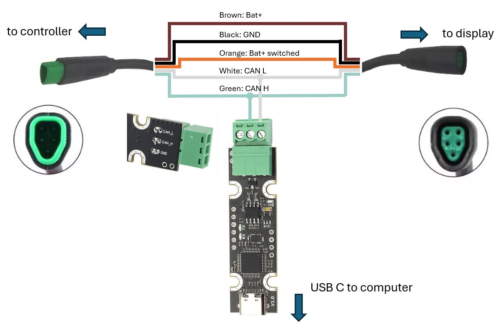
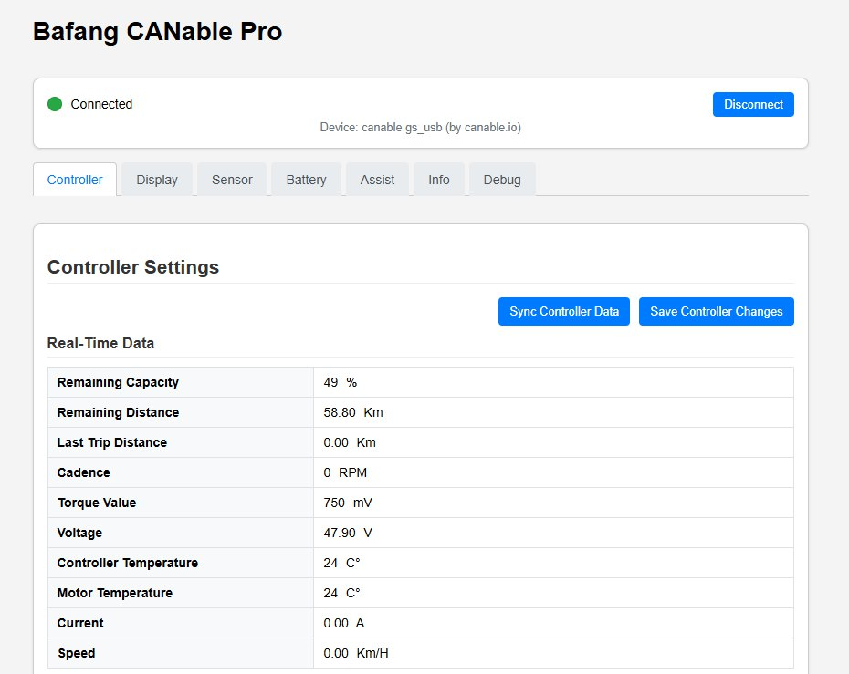

Bafang Besst software replacement for M500, M510, M560 etc  
buy a suitable [Canable](https://www.ebay.com/itm/156316405598) (needs STM32F072 processor with [candlelight firmware](https://github.com/candle-usb/candleLight_fw))  
install [NodeJS](https://nodejs.org/en/download/)  
download and unzip [this repo](https://github.com/stancecoke/bafang_canable_pro/archive/refs/heads/master.zip)  
Open the unziped folder in the windows file manager  
Double click on "Install_NPM.bat", this step is only needed once  
Connect the Canable to the PC and to your Bafang System [Tutorial how to wire the Canable](https://kaspars.net/blog/bafang-canbus)  
You can mod this kind of [display extension cable](https://aliexpress.com/item/1005005307730396.html) to loop in the Canable  
  
Double click on "Start_Tool.bat"  
Have Fun!  
  
This program is free software: you can redistribute it and/or modify it under the terms of the GNU General Public License as published by the Free Software Foundation, either version 3 of the License, or (at your option) any later version.
